# MicroGPT - Production Ready AI Assistant

MicroGPT is a full-stack AI application built with React, Express, and SQLite. It features a modern, responsive UI and integrates with multiple LLM providers.

## Features

- **Multi-LLM Support**: Switch between Google Gemini and OpenAI.
- **Real-time Chat**: Persistent chat history stored in a local SQLite database.
- **Authentication**: Secure sign-up and login system.
- **Specialized Views**:
  - **Search**: Quickly find past conversations.
  - **Images**: AI-powered image generation gallery.
  - **Apps**: Specialized AI tools for coding, data analysis, and more.
  - **Deep Research**: Advanced web-browsing and synthesis mode.
  - **Health**: AI-driven health monitoring dashboard.
- **Responsive Design**: Fully functional on desktop, tablet, and mobile devices.
- **Production Ready**: Includes error handling, toast notifications, and database persistence.



## Tech Stack

- **Frontend**: React, TypeScript, Tailwind CSS, Framer Motion, Lucide Icons.
- **Backend**: Node.js (Express), SQLite (`better-sqlite3`).
- **AI Integration**: Google Generative AI SDK, OpenAI API.

## Getting Started

1. **Environment Variables**:
   - Set `GEMINI_API_KEY` in your environment for Gemini support.
   - Set `OPENAI_API_KEY` for OpenAI support.

2. **Installation**:
   ```bash
   npm install
   ```

3. **Development**:
   ```bash
   npm run dev
   ```

4. **Production Build**:
   ```bash
   npm run build
   npm start
   ```

## LLM Connectivity

MicroGPT is designed to be model-agnostic. By default, it connects to:
- **Google Gemini**: Using the `@google/genai` SDK directly from the frontend.
- **OpenAI**: Via a secure backend proxy to protect your API keys.

You can easily extend this to support other providers like Anthropic or local models by adding new routes in `server.ts`.
# Atomic-GPT-Visualizer
